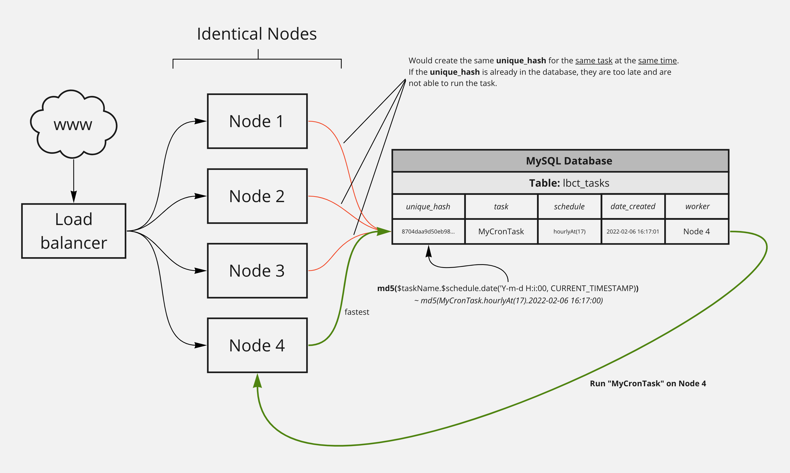

# Load Balanced Cron Task

## Introduction
This is a lightweight package for load balancing your cron tasks. It is used to distribute tasks 
across a network of **identical servers** to make sure they are run only once and not multiple times. 
>It is important that your application network uses only one single central mysql database. 
A table is created in the database in which current tasks are inserted. 
A primary key ensures that the task only runs once (a kind of locking process).
> 
> the ***unique_hash*** is a md5 hash of the task name, the schedule and the current timestamp ***without*** seconds. With this, the nodes can run asynchronously but the task runs only once at a time.

---

### Scheme of operation



## Requirements
- MySQL Database
- PHP PDO Extension (ext-pdo, ext-pdo_mysql)

## 1. Installation

### 1.1 Composer

Install `Load Balanced Cron Task` using Composer.

```bash
$ composer require incapption/load-balanced-cron-task
```

### 1.2 Create MySQL Table

This package needs a small table in your database. 
It's used for locking running tasks, to make sure that only on app instance could run it.

```sql
CREATE TABLE IF NOT EXISTS `lbct_tasks` (
`id` int(11) NOT NULL AUTO_INCREMENT,
`unique_hash` varchar(32) NOT NULL,
`task` varchar(256) NOT NULL,
`schedule` varchar(256) NOT NULL,
`date_created` datetime NOT NULL,
`worker` varchar(256),
PRIMARY KEY (`unique_hash`),
KEY `id` (`id`)
);
```

### 1.3 Install Crontab

The idea is that you have only one single cron task running every minute. 
This cron task contains all other tasks wrapped by **LoadBalancedCronTask**

Open your crontab console (e.g. linux: ```crontab -e```)
```bash
* * * * /usr/bin/php /your/local/path/cron.php
```

### 1.4 Create your cron file

Maybe you want to integrate into your application, or you create a new plain file.

```php
<?php

use Incapption\LoadBalancedCronTask\Abstracts\CronTaskAbstract;
use Incapption\LoadBalancedCronTask\LoadBalancedCronTask;
use Incapption\LoadBalancedCronTask\Exceptions\LoadBalancedCronTaskException;

require_once('./vendor/autoload.php');

class TestCronTask extends CronTaskAbstract
{
    public function __construct()
    {
        $this->name = 'TestCronTask';
    }

    public function task(): bool
    {
        // do your cron task
        return file_put_contents('test.html', 'awesome! it works! '.date('Y-m-d H:i:s', time()));
    }
}

try {
    $response = (new LoadBalancedCronTask())
        ->mysql($_ENV['MYSQL_HOST'], $_ENV['MYSQL_USER'], $_ENV['MYSQL_PASSWORD'], $_ENV['MYSQL_DATABASE'])
        ->setWorkerName('Node 1')
        ->task((new TestCronTask()))
        ->loadBalanced()
        ->everyMinute()
        ->run();
} catch (LoadBalancedCronTaskException $e) {
    exit($e->getMessage());
}
```
___

## 2. How to use it

As shown in the example above you need to create classes for your cron tasks that extends ***CronTaskAbstract***. 
Define the behavior in the ***task()*** method.

Second create the load balanced cron task.

```php
# Example for a distributed load balanced cron task
 
$response = (new LoadBalancedCronTask())
    ->mysql($_ENV['MYSQL_HOST'], $_ENV['MYSQL_USER'], $_ENV['MYSQL_PASSWORD'], $_ENV['MYSQL_DATABASE'])
    ->setWorkerName('Node 1')
    ->task((new TestCronTask()))
    ->loadBalanced()
    ->everyMinute()
    ->run();

# Example for a local cron task
 
$response = (new LoadBalancedCronTask())
    ->task((new TestCronTask()))
    ->local()
    ->everyMinute()
    ->run();
```

### 2.1 Chainable methods

#### General:

| Method | Description                                                                                                                                                  |
| ----------- |--------------------------------------------------------------------------------------------------------------------------------------------------------------|
| ->mysql(string $host, string $user, string $password, string $database) | Sets the mysql credentials for the underlying pdo instance                                                                                                   |
| ->setWorkerName(string $name) | Sets the name of the current worker. Perhaps you will use a environment variable                                                                             |
| ->task(CronTaskAbstract $task) | Awaits an instance of CronTaskAbstract                                                                                                                       |
| ->local() | Sets the cron task to ***local***. No distributing and load balancing is taking place. Useful for node specific tasks such as cleaning local tmp folder etc. |
| ->loadBalanced() | Sets the cron task to ***load balanced***. The task is distributed around the network. Only one worker runs the task at a time.                              |

#### Scheduling methods:

| Method | Description |
| ----------- | ----------- |
| ->everyMinute() | Run the task every minute |
| ->everyTwoMinutes() | Run the task every two minutes |
| ->everyThreeMinutes() | Run the task every three minutes |
| ->everyTenMinutes() | Run the task every five minutes |
| ->everyFifteenMinutes() | Run the task every fifteen minutes |
| ->everyThirtyMinutes() | Run the task every thirty minutes |
| ->hourly() | Run the task every hour |
| ->hourlyAt(17) | Run the task every hour at 17 minutes past the hour |
| ->daily() | Run the task every day at 00:00 |
| ->dailyAt('17:13') | Run the task every day at 17:13 o'clock |
| ->monthly() | Run the task on the first day of every month at 00:00 |
| ->monthlyOn(4, '15:00') | Run the task every month on the 4th at 15:00 |
| ->lastDayOfMonth('15:00') | Run the task on the last day of the month at 15:00 |
| ->lastDayOfMonthOffset(2, '15:00') | Run the task on the last day of the month at 15:00 with an offset of 2 days. As an example: ***lastDayOfMonthOffset(2, '15:00')*** in january, which has 31 days, runs on the 29th at 15 o'clock|

> Be careful with the days 29th, 30th, 31st if you use ***monthlyOn()***. Maybe use ***lastDayOfMonth()*** or ***lastDayOfMonthOffset()*** instead.

___

### 3. Exceptions
An instance of **LoadBalancedCronTask()** throws a **LoadBalancedCronTaskException** when there is something wrong inside the logic for everything else you can use the default **Exception**.